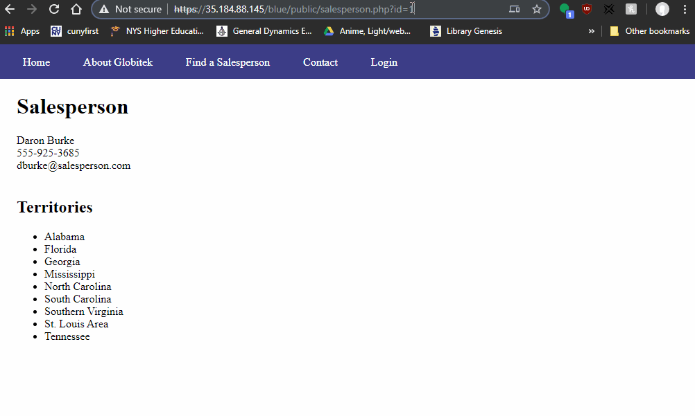
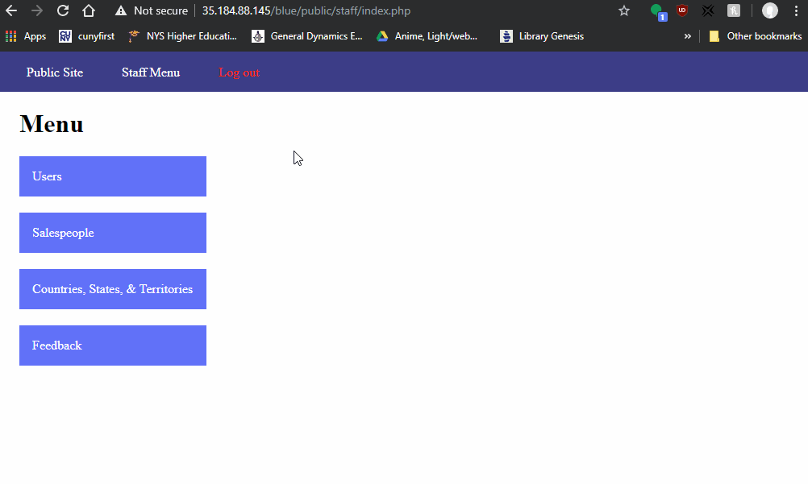
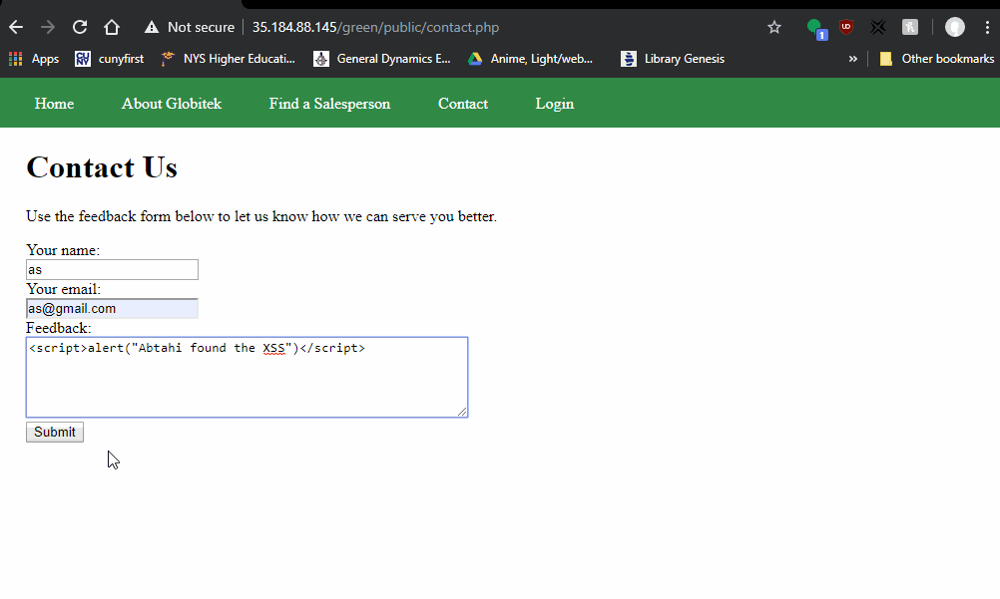

# Project 8 - Pentesting Live Targets

Time spent: **4** hours spent in total

> Objective: Identify vulnerabilities in three different versions of the Globitek website: blue, green, and red.

The six possible exploits are:
* Username Enumeration
* Insecure Direct Object Reference (IDOR)
* SQL Injection (SQLi)
* Cross-Site Scripting (XSS)
* Cross-Site Request Forgery (CSRF)
* Session Hijacking/Fixation

Each version of the site has been given two of the six vulnerabilities. (In other words, all six of the exploits should be assignable to one of the sites.)

## Blue

Vulnerability #1: SQL Injection
 - GIF Walkthrough:
	
 - Comment: Entering an sql injection into the blue site will cause a database failure whereas the other sites don't.
 - Steps to recreate:
	- navigate to https://35.184.88.145/blue/public/salesperson.php?id=1
	- set id equal to 'OR 1=1' --

Vulnerability #2: Session Hijacking/Fixation
 - GIF Walkthrough:
	
 - Comment: Using the same session id on a different browser will allow you to login automatically to the account on that browser. This doesn't happen on the green and red site.
 - Steps to recreate:
	- navigate to https://35.184.88.145/blue/public/staff/login.php
	- login with pperson and StaR!49*whiz
	- navigate to https://35.184.88.145/blue/public/hacktools/change_session_id.php on the current browser and on another browser
	- change the session id of the other browser to the id of the current browser
	- navigate to https://35.184.88.145/blue/public/staff/login.php on the other bowser
	
## Green

Vulnerability #1: Cross-Site Scripting
 - GIF Walkthrough:
	
 - Comment: The green site has a XSS vulnerability whereas the other sites don't.
 - Steps to recreate:
	- cick contact and enter some javascript into the feedback section
	- click submit, login and go to feedback
	
Vulnerability #2: __________________
 - GIF Walkthrough:
	
 - Comment:
 - Steps to recreate:
	- 

## Red

Vulnerability #1: __________________
 - GIF Walkthrough:
	
 - Comment:
 - Steps to recreate:
	- 
	
Vulnerability #2: __________________
 - GIF Walkthrough:
	
 - Comment:
 - Steps to recreate:
	- 

## Notes

Describe any challenges encountered while doing the work
